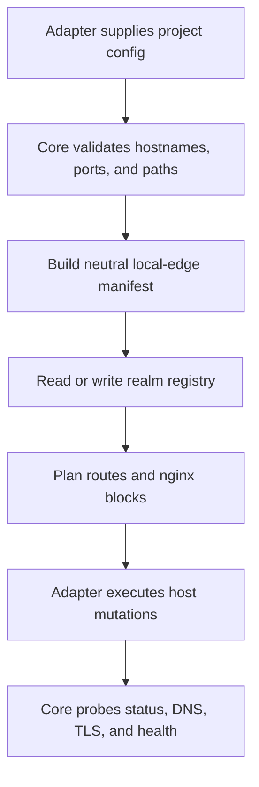

# @gg-utils/local-edge-core

Agnostic local-edge primitives for local HTTPS routing, route manifests, hostnames, DNS/TLS
planning, registry storage, health checks, log commands, and lifecycle helper logic.

This package is the pure core layer. It does not know about a consumer application's routes, package
names, environment variable policy, worktree behavior, or process manager. Those details belong in a
config adapter or in `@gg-utils/local-edge-kit`.

## Install

```bash
npm install @gg-utils/local-edge-core@git+https://github.com/gg-utils/local-edge-core.git#main
```

Pinned dependency example:

```json
{
  "dependencies": {
    "@gg-utils/local-edge-core": "git+https://github.com/gg-utils/local-edge-core.git#9b91ed7"
  }
}
```

## When To Use

- You need neutral route-manifest, realm-registry, hostname, or URL-matrix helpers.
- You need nginx server-block rendering primitives for local reverse proxying.
- You need DNS, TLS, network listener, status, healthcheck, or runtime-stop helper logic.
- You are building a project-specific local-edge CLI and want pure helpers underneath it.

Skip this package when you need a fully wired CLI around a project config; use
`@gg-utils/local-edge-kit` for that layer.

## Public Surfaces

| Import | Purpose |
|---|---|
| `@gg-utils/local-edge-core/manifest` | Manifest contracts and route grouping. |
| `@gg-utils/local-edge-core/registry` | Realm registry contracts. |
| `@gg-utils/local-edge-core/registry-json-store` | JSON store helpers with locking and atomic writes. |
| `@gg-utils/local-edge-core/hostname` | Hostname and slug helpers. |
| `@gg-utils/local-edge-core/route-plan` | Manifest-driven route planning. |
| `@gg-utils/local-edge-core/nginx` | Nginx rendering primitives. |
| `@gg-utils/local-edge-core/tls` | mkcert and certificate planning helpers. |
| `@gg-utils/local-edge-core/network` | Listener, loopback, and probe helpers. |
| `@gg-utils/local-edge-core/healthcheck` | Healthcheck argv, probe, and summary helpers. |
| `@gg-utils/local-edge-core/cli` | CLI parsing and dry-run output helpers. |

## Quick Start

```ts
import {
  type LocalEdgeCore_Manifest,
  type LocalEdgeCore_RealmRecord,
  LocalEdgeCore_buildManifestRoutePlan,
  LocalEdgeCore_slugifySegment,
} from "@gg-utils/local-edge-core";

declare const manifest: LocalEdgeCore_Manifest;
declare const registryRecord: LocalEdgeCore_RealmRecord;

const realm = LocalEdgeCore_slugifySegment("Feature Branch");
const routePlan = LocalEdgeCore_buildManifestRoutePlan({
  manifest,
  registryRecord,
});

console.log({ realm, routes: routePlan.surfaces.length });
```

## Operational Flow



## CLI

The package exposes a `local-edge` bin for core-level command helpers:

```bash
npx @gg-utils/local-edge-core@git+https://github.com/gg-utils/local-edge-core.git#main local-edge --help
```

Project CLIs usually wrap this core surface through `@gg-utils/local-edge-kit` so app-specific
config, prompts, and process execution remain outside the core.

## Development

```bash
git clone https://github.com/gg-utils/local-edge-core.git
cd local-edge-core
npm run type-check
npm test
npm run build
npm run pack:dry-run
```

The extracted scripts currently expect the source-first workspace toolchain.

## Layout

```text
.
|-- bin/local-edge.js
|-- src/manifest.ts
|-- src/registry.ts
|-- src/hostname.ts
|-- src/route-plan.ts
|-- src/nginx.ts
|-- src/tls.ts
|-- src/network.ts
|-- src/healthcheck.ts
|-- dist/
`-- package.json
```

## Caveats

- Host mutations are planned through neutral helpers; adapters perform actual privileged actions.
- Keep project route catalogs, root zones, env defaults, and process commands outside this package.
- Some exports target source-first consumption through TypeScript source paths.
